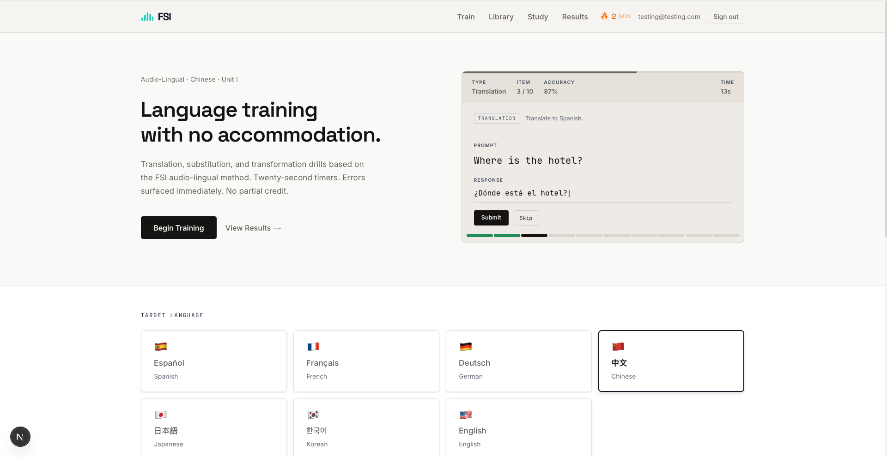
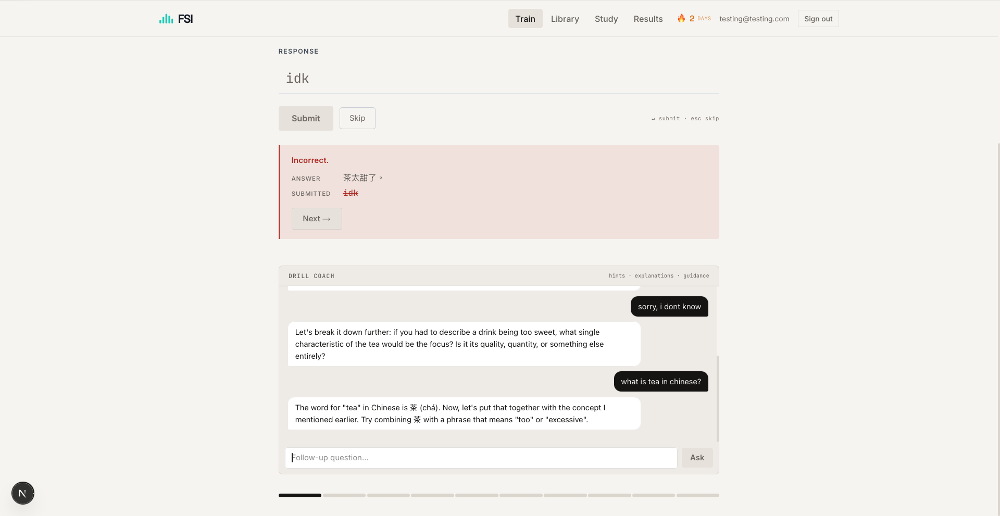
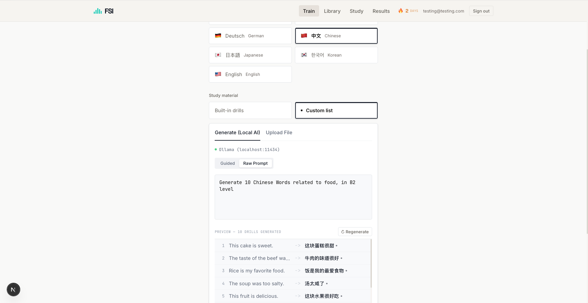
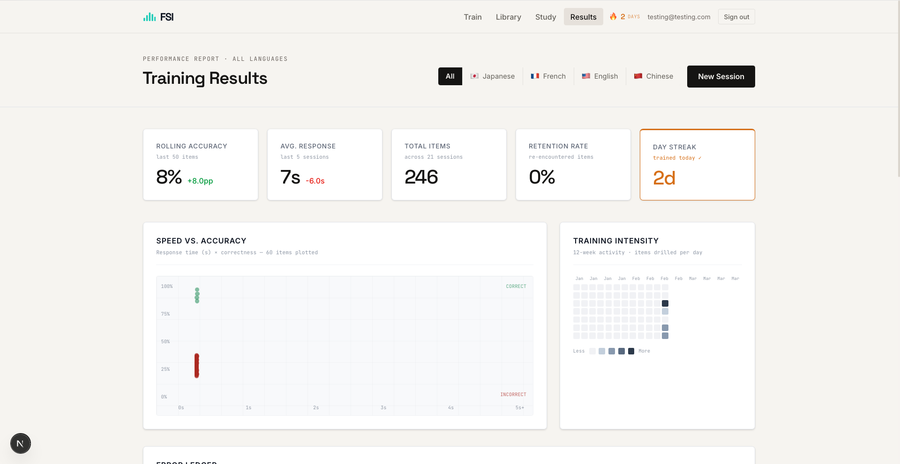
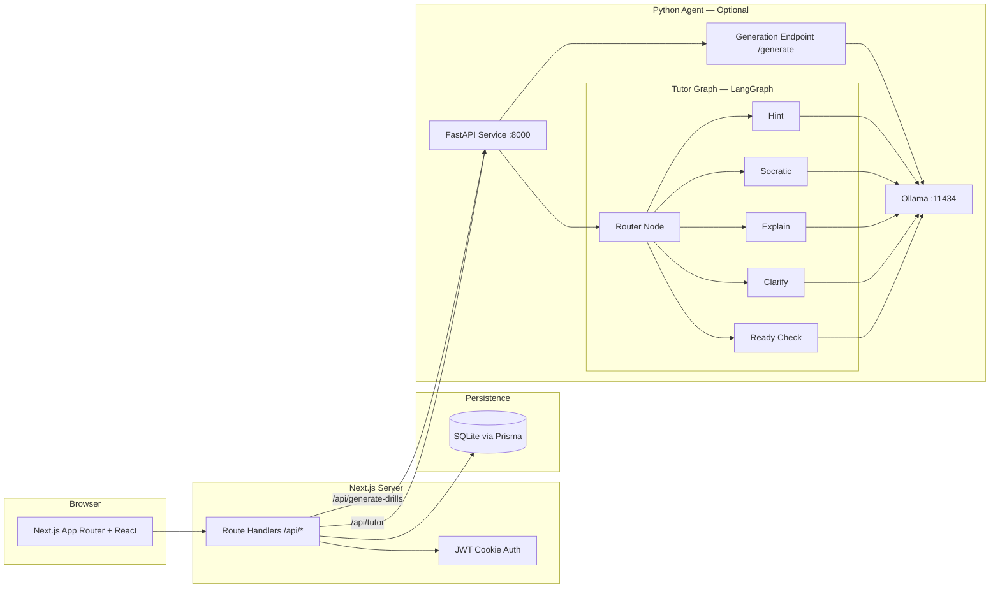
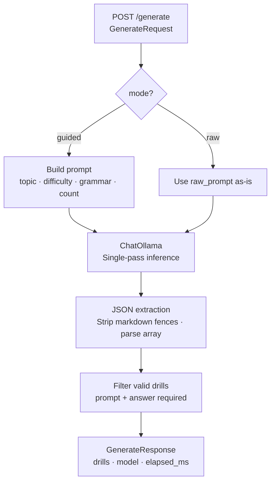
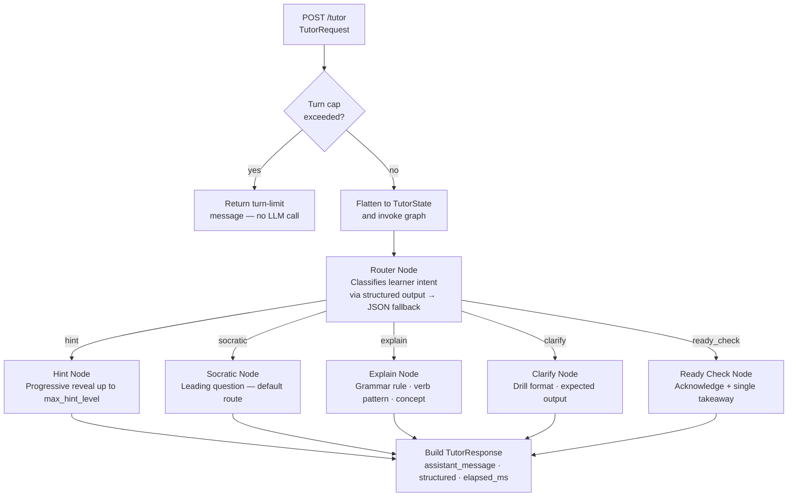

# FSI-2026 — AI-Assisted Language Drill Platform

[](https://github.com/JefferyLiu6/fsi-2026/actions/workflows/ci.yml)

> **Live demo:** _coming soon_ · [Walkthrough video](#) _(placeholder)_

A full-stack language learning platform that combines timed FSI-style drills with an AI tutor and optional AI drill generation.

The project is designed to demonstrate production-oriented software engineering and applied AI integration:
- Strong end-to-end architecture (`Next.js` + `Prisma` + `FastAPI` + `LangGraph`)
- Authenticated multi-user data flows and session persistence
- Typed API contracts between TypeScript and Python services
- Automated quality checks via tests and CI

## Why This Project Is Portfolio-Grade

- **Real product scope**: auth, persistence, dashboard analytics, content library, and coaching workflows.
- **AI engineering depth**: deterministic request/response contracts, route-aware coaching graph, guardrails, and error mapping.
- **Engineering discipline**: test suite plus CI checks for lint, type safety, tests, build, and Python syntax validation.

## Feature Set

- **Core drills**: translation, substitution, transformation
- **Languages**: Spanish, French, German, Chinese, Japanese, Korean, English
- **User flows**:
  - Register/login with JWT cookie session
  - Run timed drills and receive immediate feedback
  - Track performance on a personal dashboard
  - Browse full drill library by language/topic/category
- **Optional AI capabilities**:
  - Generate custom drills via local Ollama model
  - Ask AI tutor for hints, explanations, clarifications, and readiness checks

## Screenshots

**Home — drill session widget and language picker**


**Drill feedback + AI Tutor coaching exchange**


**AI Drill Generation — raw prompt mode with live preview**


**Results dashboard** — rolling accuracy, response time, training intensity heatmap


## System Architecture



## Tech Stack

| Area | Technologies |
|---|---|
| Frontend | Next.js 16, React 19, Tailwind CSS 4 |
| Backend (Web) | Next.js Route Handlers, TypeScript |
| Backend (AI) | FastAPI, LangGraph, LangChain Ollama |
| Data | Prisma 7, SQLite (`@prisma/adapter-libsql`) |
| Auth | `jose` (HS256 JWT in httpOnly cookie), `bcryptjs` |
| Testing | Vitest (unit + integration) |
| CI | GitHub Actions (`lint`, `tsc`, `test`, `build`, Python `py_compile`) |

## Engineering Highlights

### 1) Typed cross-service API bridge
The Next.js API layer maps frontend camelCase payloads to Python snake_case contracts and maps responses back to frontend shape. This keeps the UI ergonomic without sacrificing strict backend contracts.

### 2) LangGraph tutor orchestration
The tutor service uses a router-plus-specialists graph:
- router classifies learner intent (`hint`, `socratic`, `explain`, `clarify`, `ready_check`)
- conditional edges dispatch to specialist nodes
- each specialist applies route-specific prompting policy
- guardrails enforce turn limits and stable fallback behavior

### 3) Security and session model
- Login issues a signed JWT (`fsi_auth`) in an `httpOnly` cookie with `SameSite=Lax`
- Protected app routes are enforced by `proxy.ts`
- Data routes require authenticated session; AI routes are restricted in production mode

### 4) Reliability workflow
- Unit tests for auth and drill logic
- Integration tests for auth flow and per-user session isolation
- CI pipeline validates code health before merge

## Agent System Design

The Python agent exposes two independent sub-systems on the same FastAPI service.

### Drill Generation (single-pass)



### Tutor Graph (LangGraph)



**Key design decisions:**
- **Guardrail before the graph** — turn cap is enforced in the endpoint, not inside a node, so the LLM is never called unnecessarily
- **Router uses structured output with JSON fallback** — tolerates models that ignore tool-call format
- **Specialist nodes share a single `_run_specialist` helper** — prompting policy is centralized; LangGraph conditional edges select the node
- **`hint_level` increments only on the hint route** — other routes leave it unchanged, preserving progressive-reveal state across turns

## API Surface (Web Layer)

| Method | Path | Purpose | Auth |
|---|---|---|---|
| POST | `/api/register` | Create user account | No |
| POST | `/api/auth/login` | Sign in and set cookie | No |
| POST | `/api/auth/logout` | Clear cookie | Cookie |
| GET | `/api/auth/me` | Return current session | Cookie |
| GET/POST | `/api/sessions` | Load/save drill sessions | Yes |
| GET/PUT | `/api/custom-list` | Load/save custom drills | Yes |
| GET/PUT | `/api/language` | Load/save preferred language | Yes |
| POST | `/api/generate-drills` | Proxy to Python generation endpoint | Dev open / Prod guarded |
| POST | `/api/tutor` | Proxy to Python tutor endpoint | Dev open / Prod guarded |

## Data Model

Prisma schema includes:
- `User` (identity + credentials)
- `DrillSession` (session performance + serialized results)
- `CustomList` (user-generated drill sets)
- `UserSettings` (preferences such as language)

SQLite is used for local-first simplicity; migration path to Postgres is straightforward by changing Prisma provider and running migrations.

## Local Development

### Prerequisites
- Node.js 20+
- pnpm
- Python 3.10+ (only if running the AI agent)
- Ollama (only if using AI generation/tutor)

### 1) Install and run the web app

```bash
cd fsi-2026
pnpm install
npx prisma generate
npx prisma db push
pnpm dev
```

Open `http://localhost:3000`.

### 2) Run optional AI agent

Terminal A:

```bash
ollama serve
ollama pull llama3.1
```

Terminal B:

```bash
cd fsi-2026/agent
python -m venv .venv
source .venv/bin/activate
pip install -r requirements.txt
uvicorn main:app --host 0.0.0.0 --port 8000 --reload
```

Health check:

```bash
curl http://localhost:8000/health
```

## Environment Variables

Create `.env.local` from `.env.example`.

| Variable | Required | Description |
|---|---|---|
| `DATABASE_URL` | Yes | Prisma database URL (for SQLite: `file:./prisma/dev.db`) |
| `JWT_SECRET` | Yes | Secret for signing JWT cookies |
| `AGENT_URL` | No | Python agent base URL (default `http://localhost:8000`) |

## Scripts

| Command | Purpose |
|---|---|
| `pnpm dev` | Start dev server |
| `pnpm build` | Build production bundle |
| `pnpm start` | Start production server |
| `pnpm lint` | Run ESLint |
| `pnpm test` | Run Vitest suite |
| `pnpm test:watch` | Run tests in watch mode |

## Quality and CI

- Test files live under `__tests__/` (unit + integration coverage)
- CI workflow in `.github/workflows/ci.yml` runs:
  - `pnpm lint`
  - `npx tsc --noEmit`
  - `pnpm test`
  - `pnpm build`
  - Python syntax checks for all agent modules

## Production Notes

- Rotate `JWT_SECRET` carefully (rotation invalidates existing sessions)
- Serve over HTTPS so secure cookies are active in production
- Add rate limiting and auth hardening around AI-heavy routes for internet-facing deployments
- For multi-instance deployments, migrate from SQLite to Postgres

## Known Limitations

- AI features depend on local Ollama availability unless replaced with hosted inference
- SQLite is optimized for local/single-node usage
- Tutor/generation endpoints currently prioritize local development ergonomics

## Roadmap

- Add end-to-end tests for critical user flows
- Add observability (request tracing and endpoint latency dashboards)
- Add model routing/fallback policies for AI endpoints
- Introduce migration-backed Postgres production profile
- Publish demo deployment and walkthrough video

## License

MIT © JL200126 — see [LICENSE](LICENSE).
